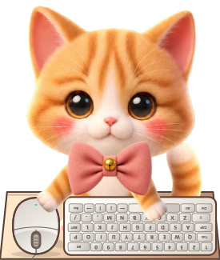

# 糯米桌面宠物

一只会跟着键盘和鼠标互动、也会自己玩耍的 Windows 橘猫桌宠。

[⬇ 直接下载最新版（NuoMi-Desktop-Pet.exe）](https://github.com/lecdwin/NuoMi-Desktop-Pet/releases/latest/download/NuoMi-Desktop-Pet.exe)

**Windows 10/11｜单文件约 3.8 MB｜免安装｜无需管理员权限**



> 普通用户只需要下载上面的 EXE。GitHub 自动提供的 “Source code”
> 压缩包是给开发者看的，不是安装包。

## 30 秒开始使用

1. 点击上面的“直接下载最新版”。
2. 把 `NuoMi-Desktop-Pet.exe` 放到一个固定位置，例如桌面或文档文件夹。
3. 双击 EXE，糯米就会出现在桌面上，不需要安装或解压。
4. 右键小猫可以打开全部互动和设置。
5. 如果小猫被隐藏了，双击原来的 EXE，或双击任务栏右下角 `^` 里的小猫图标即可找回。

如果你移动了 EXE，程序会识别旧的开机启动路径；在新位置重新勾选
“开机自动显示糯米”即可修复。

## 第一次运行出现“Windows 已保护你的电脑”？

当前发布文件没有商业数字签名，所以 Windows SmartScreen 可能会提示。

请先确认文件来自本仓库的
[Releases 页面](https://github.com/lecdwin/NuoMi-Desktop-Pet/releases)，
文件名是 `NuoMi-Desktop-Pet.exe`。确认无误后，可以点击：

**更多信息 → 仍要运行**

不需要关闭 Windows 安全中心或杀毒软件。如果仍然不放心，可以核对 Release
页面提供的 SHA-256，或者按照下方步骤自行从源码构建。

## 怎么玩

- **搬家：** 按住小猫拖动；松手时会自动留在屏幕可见范围内。
- **摸摸：** 单击头部或身体；碰尾巴会有不同反应。
- **打招呼：** 双击小猫，它会回应并挥爪。
- **喂食和玩具：** 右键小猫，选择小鱼干、毛线球、摸头或杯子。
- **键盘鼠标互动（Bongo）：** 按哪个键，画面上的对应键帽就会亮起并下沉。
- **调整大小：** 右键选择“大小”，可输入 60%–150% 的任意整数百分比。
- **全屏隐藏：** 看电影或玩游戏进入全屏时自动隐藏，退出全屏后自动回来。
- **后台运行：** 选择“隐藏到托盘（继续运行）”后仍可随时找回；“退出程序（停止运行）”才会彻底关闭。
- **遇到问题：** 菜单里的“使用帮助”和“恢复推荐设置”可以随时作为兜底。

这里把糯米当成坐在电脑前的使用者：空格键靠近小猫，数字行远离小猫，
键帽文字从小猫方向可读；鼠标的掌心端靠近小猫，按键、滚轮前端和线缆
朝向屏幕下方（也就是朝你这边）。这才是小猫正常使用设备的真实摆法。
物理左键会落在面对你的“小猫视角右半区”，物理右键会落在左半区。
这是刻意按照小猫面对你的方向设计的。

## 主要功能

- 真实键位、鼠标左右键和滚轮反馈，带准备、落爪、长按、回弹和收势。
- 自主观察、扑鼠标、讨食、梳毛、伸懒腰、睡觉、疯跑和玩耍；
  开着键盘鼠标互动时也会自行触发，并会在活动后回到原来的位置。
- 可点击的饭碗、杯子和毛线球，不同区域有不同互动反馈。
- 多显示器、DPI 和高刷新率适配，拖拽不会掉出屏幕。
- 60%–150% 整数百分比缩放（含常用预设），小猫、键鼠和道具同步变化。
- 全屏电影或游戏自动隐藏、稳定退出后自动恢复，不抢走当前窗口焦点。
- 小猫右键与托盘右键使用统一的圆角扁平菜单，互动、陪伴风格、大小和设置
  分组清晰。
- 自然低频尾巴摆动、三档陪伴风格、置顶、托盘后台和开机自启。
- 透明区域不会挡住下面的软件；显示和自动恢复时也不会抢走当前输入焦点。
- 所有必要素材内置在单个 EXE 中，离线运行，不需要管理员权限。

<details>
<summary>查看完整技术细节</summary>

- 透明无边框 WPF 桌面窗口。
- 头部、睁眼/闭眼、身体、两只前爪、尾巴和蝴蝶结采用独立图层。
- 鼠标注视死区、头部滞后、快速转头眨眼、不规则呼吸和重心变化。
- 实际字母、数字和常用功能键逐键高亮，组合键可以同时亮起。
- 键帽下沉、阴影缩短，爪子会根据键位横向位置和所在行寻找落点。
- 键鼠动作分为准备、接触、压下、保持、回弹和恢复阶段。
- 动画跟随 Windows 桌面合成器逐帧刷新，弹簧以最高 120 Hz 子步进更新。
- 饥饿、活力、心情、亲密度和无聊度会随时间变化并保存在本机。
- 自主行为带最近行为记忆和冷却，减少机械重复。
- 饥饿或困倦达到明显程度时会主动表达，不会被持续键鼠输入永久压住。
- 全屏检测区分用户主动隐藏和临时自动隐藏，并只检查小猫所在的显示器。
- 拖拽会安全中断自主行为，并带有速度滞后和松手回稳。
- 显示器布局或分辨率改变后会重新检查宠物位置。
- 单实例运行；重复双击 EXE 会直接叫回已经运行的糯米，不会出现第二只宠物。

</details>

## 隐私说明

糯米不需要账号，没有广告，也不会联网或上传数据。

- 只有在小猫可见且开启“键盘鼠标互动（Bongo）”时，程序才接收虚拟键按下/松开、
  鼠标位置和按钮状态来播放动画。
- 程序不会把按键还原或拼接成输入文字，不记录、不保存、不上传输入内容。
- 关闭键盘鼠标互动或隐藏宠物后，键鼠监听会停止。
- 位置、选项和宠物状态只保存在当前 Windows 用户的注册表：
  `HKCU\Software\NuoMiDesktopPet`。
- 只有用户主动开启“开机自动显示糯米”时，程序才会写入当前用户的启动项。

详细说明见 [PRIVACY.md](PRIVACY.md)。

## 常见问题

### 双击后没有出现第二只小猫

这是正常的：程序只运行一只糯米。重复双击 EXE 会把已经运行的小猫直接叫回屏幕。

### 小猫不见了

如果正在全屏看电影或玩游戏，这是默认的自动隐藏；退出全屏约 1.5 秒后会恢复。
其他情况下，重新双击 EXE、双击托盘里的小猫图标，或右键托盘图标选择“显示糯米”。
不想自动隐藏时，可打开“更多设置”，取消勾选“全屏时自动隐藏”。
在全屏中主动从托盘叫回小猫后，本次全屏会保持显示。

### 小猫太大或太小

右键小猫或托盘图标，打开“大小”。可以直接选常用预设，也可以选择
“自定义百分比”，输入 60%–150% 的任意整数。一般推荐 60%–125%。
新用户默认为较轻巧的 80%，之后会记住你设置的百分比。

### 怎么彻底退出？

右键小猫或托盘图标，选择“退出程序（停止运行）”。
“隐藏到托盘（继续运行）”不会退出。

### 怎么取消开机自启？

右键小猫，打开“更多设置”，取消勾选“开机自动显示糯米”。

### 移动 EXE 后开机自启失效

程序会把旧路径显示为未启用；在新位置重新勾选“开机自动显示糯米”即可修复。

### 无法删除 EXE

先从小猫或托盘菜单选择“退出”，然后再删除文件。

### 怎么卸载？

取消开机自启，退出程序，然后删除 EXE 即可。程序没有安装其他文件。

### 杀毒软件提示风险

不要关闭杀毒软件。请确认文件来自本仓库 Releases，并核对文件名和哈希；
如果仍有疑虑，请不要运行，可以提交 Issue 或自行从源码构建。

### 支持 macOS 或 Linux 吗？

目前只支持 Windows，不能在 macOS 或 Linux 上直接运行。

## 开发者：从源码构建

不需要 Visual Studio、NuGet 或额外 SDK。项目使用 Windows 自带的
.NET Framework 4.x 编译器和 WPF 运行库。

1. 下载源码 ZIP，或者使用 Git 克隆仓库。
2. 在项目目录打开 PowerShell。
3. 运行：

```powershell
powershell -NoProfile -ExecutionPolicy Bypass -File .\build.ps1
```

4. 编译完成后，EXE 位于：

```text
dist\NuoMi-Desktop-Pet.exe
```

主要目录：

```text
src\          程序源代码
assets\       程序实际使用的橘猫分层素材
build.ps1     一键编译脚本
app.manifest  Windows 权限、兼容性和 DPI 设置
```

## 许可证与素材

- 程序源代码使用 [MIT License](LICENSE)。
- 图片素材不包含在 MIT 中，使用和再分发规则见
  [ASSET_NOTICE.md](ASSET_NOTICE.md)。

## 反馈问题

发现问题时，请前往
[GitHub Issues](https://github.com/lecdwin/NuoMi-Desktop-Pet/issues/new)
描述 Windows 版本、做了什么以及看到了什么。请不要上传密码、聊天内容或其他
私人信息。
